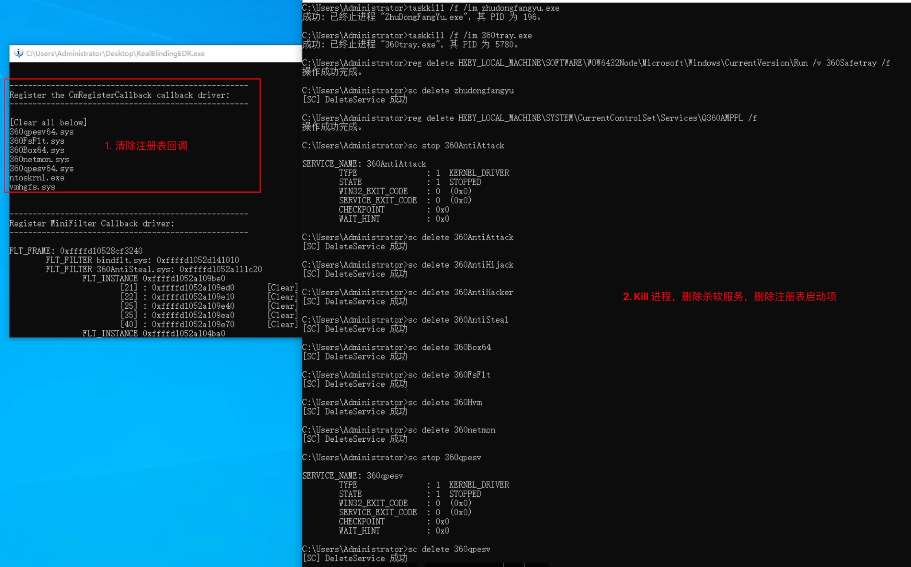

# RealBlindingEDR

[中文介绍](README.zh_CN.md)

Utilize arbitrary address read/write implementation with signed driver: completely blind or kill or permanently turn off AV/EDR.

If you want to understand the implementation principle, you can refer to the analysis article: [AV/EDR 完全致盲 - 清除6大内核回调实现（Chinese）](https://mp.weixin.qq.com/s/ZMTjDMMdQoOczxzZ7OAGtA)

**This project has been tested on 64-bit win7, win10, and win11. I will further test it on other versions later. If you find a problem in a certain version, you can report it through issue and I will adapt it. **

## Introduction

This project implements the clearing of the following kernel callbacks:

1. Delete the callback registered by `CmRegisterCallback(Ex)`
2. Delete the callback registered by `MiniFilter driver`
3. Delete the callbacks registered by `ObRegisterCallbacks()`
4. Delete the callback registered by `PsSetCreateProcessNotifyRoutine(Ex)`
5. Delete the callback registered by `PsSetCreateThreadNotifyRoutine(Ex)`
6. Delete the callback registered by `PsSetLoadImageNotifyRoutine(Ex)`

**After deleting the kernel callback, the following 3 effects can finally be achieved:**

1. **Blinding AV/EDR**
    
     While keeping the AV/EDR process running normally, it makes it impossible to monitor any process/thread activity, any file landing, registry deletion, high-privilege handle acquisition and many other sensitive behaviors. (Not killing directly is to ensure that EDR maintains communication with the master control and avoid being discovered due to disconnection)
    
2. **Permanently turn off or disable AV/EDR**
    
     Since the registry and minifilter kernel notification callbacks are deleted, AV/EDR can be permanently turned off (even if the system is restarted) by modifying the registry or directly deleting the AV/EDR file.
    
3. **Kill AV/EDR process**
    
     Since the object handle notification callback has been removed, it is now possible to terminate the AV/EDR process with normal administrator user rights.

## Disclaimer

This project is not targeted at any AV/EDR manufacturers. The code examples are only for research and learning, and are not allowed to be used maliciously. If there is any malicious use, it has nothing to do with me.

## Usage

1. Download the project code, open the `RealBlindingEDR.h` file, and configure the absolute path where the available driver is located.
	
	This project supports two driver applications: [dbutil_2_3.sys](https://www.loldrivers.io/drivers/a4eabc75-edf6-4b74-9a24-6a26187adabf/) 、[echo_driver.sys](https://www.loldrivers.io/drivers/afb8bb46-1d13-407d-9866-1daa7c82ca63/)
	
	`#define DriverType 1` means using echo_driver.sys
   
   `#define DriverType 2` means using dbutil_2_3.sys
   
   `#define DrivePath "driver_fullpath"` is used to specify the path where the driver is located
     
    The dbutil_2_3.sys driver supports win7 and above.
    
    The echo_driver.sys driver supports win10 and above.
    
    **Note:** Currently, these two drivers cannot be loaded on the latest version of Win11 [10.0.22621.2506] (certificate revoked, error: c0000603)
    
2. Compile the project and double-click to execute it on the computer with AV/EDR installed. (If the file is not immune to anti-virus, please write your own anti-virus shellcode loader, then convert it into shellcode and load it)
3. After execution, you will see the following effect: (listing the names of all drivers that registered these callbacks)
    
     
     
4. Open the `RealBlindingEDR.h` file again and add the driver names that you are sure are AV/EDR to the `CONST CHAR* AVDriver[] = {}` array.
     An example of configuring the Defender driver:
     
     You can also try to find the AV/EDR driver name based on the signature in the `C:\windows\system32\drivers\` directory.
     
     **Note:** Be sure not to add the normal driver name of Windows system to this array, otherwise it may cause the system to crash.
5. Compile again and run it directly to automatically clear all the above callbacks of the specified driver.

## Effect
The following demonstration content is not specific to this AV manufacturer, but is only for educational and research purposes. Most AV/EDR manufacturers are affected.

***Tips:*** By executing the program directly, you can achieve all of the following effects.

[DemoVideo](Demovideo.mp4)

1. Delete AV/EDR object handle monitoring and kill AV process
	
     
2. Delete AV/EDR registry monitoring and delete AV registry to permanently shut down AV
	
     

3. Delete file landing monitoring and AV/EDR own file protection, delete AV files to permanently close AV
	
     
## To be done
1. Clear the handles related to the Windows ETW event provider in the kernel.
2. Try removing WFP related callbacks.
3. ...
## Acknowledgments

Thanks to the following articles and projects for helping me.

1. [OBREGISTERCALLBACKS AND COUNTERMEASURES](https://douggemhax.wordpress.com/2015/05/27/obregistercallbacks-and-countermeasures/)
2. [Windows Anti-Debug techniques - OpenProcess filtering](https://blog.xpnsec.com/anti-debug-openprocess/)
3. [Mimidrv In Depth: Exploring Mimikatz’s Kernel Driver](https://medium.com/@matterpreter/mimidrv-in-depth-4d273d19e148)
4. [Part 1: Fs Minifilter Hooking](https://aviadshamriz.medium.com/part-1-fs-minifilter-hooking-7e743b042a9d)
5. [EchoDrv](https://github.com/YOLOP0wn/EchoDrv)
6. [Windows Kernel Ps Callbacks Experiments](http://blog.deniable.org/posts/windows-callbacks/)
7. [Silencing the EDR. How to disable process, threads and image-loading detection callbacks](https://www.matteomalvica.com/blog/2020/07/15/silencing-the-edr/)
8. [Removing-Kernel-Callbacks-Using-Signed-Drivers](https://br-sn.github.io/Removing-Kernel-Callbacks-Using-Signed-Drivers/)
9. [EchOh-No! a Vulnerability and PoC demonstration in a popular Minecraft AntiCheat tool](https://ioctl.fail/echo-ac-writeup/)