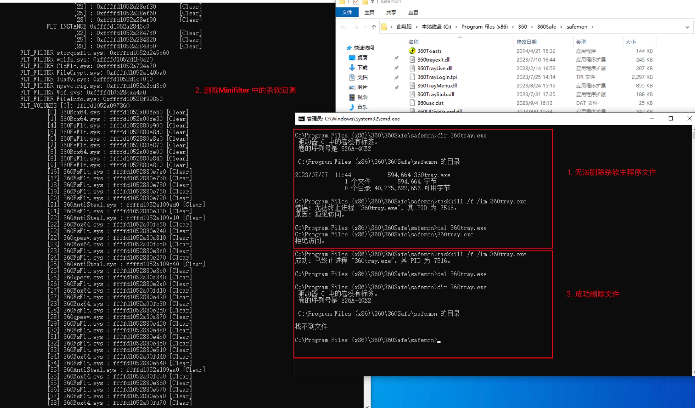

# RealBlindingEDR

利用带签名驱动的任意地址读/写实现：完全致盲、或杀死、或永久关闭 AV/EDR。

如果你想了解实现原理可以参考分析文章：[AV/EDR 完全致盲 - 清除6大内核回调实现](https://mp.weixin.qq.com/s/ZMTjDMMdQoOczxzZ7OAGtA)    [欢迎关注此公众号]

**当前已在64位的 Windows 7/10/11、Windows Server 2008R2/2012R2/2016/2019/2022 完成测试。如果你发现在某个版本有问题，可通过issue 反馈，我会进行适配。**

## 简介

本项目实现了以下内核回调的清除：

1. 删除 `CmRegisterCallback(Ex)` 注册的回调
2. 删除 `MiniFilter微过滤器驱动`注册的回调
3. 删除 `ObRegisterCallbacks()` 注册的回调
4. 删除 `PsSetCreateProcessNotifyRoutine(Ex)` 注册的回调
5. 删除 `PsSetCreateThreadNotifyRoutine(Ex)` 注册的回调
6. 删除 `PsSetLoadImageNotifyRoutine(Ex)` 注册的回调

**删除内核回调后，最终可实现以下3点效果：**

1. **致盲 AV/EDR**
    
    在保持AV/EDR 进程正常运行的情况下，使其无法监控任何进程/线程活动、任何文件落地、注册表删改、高权限句柄获取等众多敏感行为。（不直接Kill 是为了保证EDR 与总控保持通信，避免掉线导致被发现）
    
2. **永久关闭或禁用 AV/EDR**
    
    由于删除了注册表和微过滤器内核通知回调，可以修改注册表或直接删除AV/EDR 文件的方式永久关闭AV/EDR（即使系统重启）。
    
3. **Kill AV/EDR 进程**
    
    由于删除了对象句柄通知回调，现在能够以普通管理员用户权限结束AV/EDR 进程。

## 免责声明

本项目不针对任何AV/EDR 厂商，代码示例仅用于研究学习，不得进行恶意利用，如有恶意利用与本人无关。

## 使用方式

1. 下载项目代码，打开`RealBlindingEDR.h` 文件，配置可利用驱动所在的绝对路径。
    
	本项目支持两种驱动利用：[dbutil_2_3.sys](https://www.loldrivers.io/drivers/a4eabc75-edf6-4b74-9a24-6a26187adabf/) 、[echo_driver.sys](https://www.loldrivers.io/drivers/afb8bb46-1d13-407d-9866-1daa7c82ca63/)
    
    `#define DriverType 1`  表示使用echo_driver.sys
    
    `#define DriverType 2`  表示使用dbutil_2_3.sys
    
    `#define DrivePath "driver_fullpath"`  用于指定驱动所在路径
    
    dbutil_2_3.sys 驱动支持win7及以上版本。
	 
	 echo_driver.sys 驱动支持win10及以上版本。
	 
	 **注意：** 目前这两个驱动在最新版Win11[10.0.22621.2506]上都已无法加载（证书被吊销,Error：c0000603）
	 
2. 编译项目并在安装有AV/EDR 的电脑上双击执行。(如果文件不免杀，请自行编写免杀的shellcode 加载器，然后将其转换成shellcode 后加载)
3. 执行后你会看到下面的效果：（列出了注册这些回调的所有驱动名称）
	
    

4. 再次打开`RealBlindingEDR.h` 文件，找出第一次执行输出结果的驱动名称中是AV/EDR驱动的名称，并将其添加到`CONST CHAR* AVDriver[] = {}` 数组中。
    一个配置Defender 驱动的样例：
    
    
   **注意：** 一定不要添加Windows系统正常的驱动名到此数组中，否则可能会导致系统崩溃。
5. 再次编译并直接运行，就能自动清除指定驱动的上述所有回调。    

## 效果
下面演示内容并不针对此AV 厂商，仅出于教育研究目的，绝大多数AV/EDR 厂商都能达到同样的效果。

***Tips:*** 直接执行程序，就可以实现以下所有效果。

[演示视频](Demovideo.mp4)
1. 删除AV/EDR 对象句柄监控，Kill AV进程
	
    
2. 删除AV/EDR 注册表监控，删除AV注册表来实现永久关闭AV
	
    

3. 删除文件落地监控和AV/EDR 自身文件保护，删除AV文件来实现永久关闭AV
	
    

## 待做

1. 清空内核中Windows ETW事件提供者相关句柄。
2. 尝试删除WFP相关回调。
3. ...

## 致谢

***PS:*** 特别感谢我的领导能给我足够的时间去研究，最终才能有此项目。

感谢以下文章和项目，给我思路上的帮助。
1. [OBREGISTERCALLBACKS AND COUNTERMEASURES](https://douggemhax.wordpress.com/2015/05/27/obregistercallbacks-and-countermeasures/)
2. [Windows Anti-Debug techniques - OpenProcess filtering](https://blog.xpnsec.com/anti-debug-openprocess/)
3. [Mimidrv In Depth: Exploring Mimikatz’s Kernel Driver](https://medium.com/@matterpreter/mimidrv-in-depth-4d273d19e148)
4. [Part 1: Fs Minifilter Hooking](https://aviadshamriz.medium.com/part-1-fs-minifilter-hooking-7e743b042a9d)
5. [EchoDrv](https://github.com/YOLOP0wn/EchoDrv)
6. [Windows Kernel Ps Callbacks Experiments](http://blog.deniable.org/posts/windows-callbacks/)
7. [Silencing the EDR. How to disable process, threads and image-loading detection callbacks](https://www.matteomalvica.com/blog/2020/07/15/silencing-the-edr/)
8. [Removing-Kernel-Callbacks-Using-Signed-Drivers](https://br-sn.github.io/Removing-Kernel-Callbacks-Using-Signed-Drivers/)
9. [EchOh-No! a Vulnerability and PoC demonstration in a popular Minecraft AntiCheat tool](https://ioctl.fail/echo-ac-writeup/)

